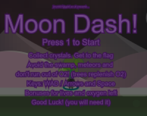

I'm Jake, a security focused front end developer based in the UK. See my [full portfolio][2] and contact me on [LinkedIn][1].

## Technologies

## Projects

- Room Booking 
- Java simulation
- Forum
- Gaming
- Android Applications (take away store, maths improvement)

<!--## GitHub Stats

-->

## Play Moon Dash!

<!-- social media accounts -->
[1]: https://www.linkedin.com/in/jbrun001/
[2]: https://jbrun001.github.io/allprojects.html

